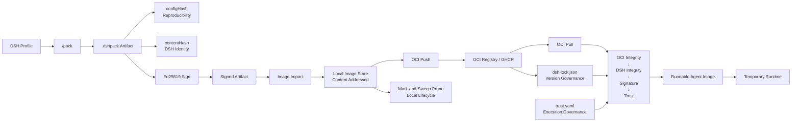

# dsh-pack

> **Reproducible, portable, signed, runnable and OCI-distributable Agent Artifacts for DeepSeek Harness.**
>
> `npm install @why-daydream/dsh-pack`

[](https://www.npmjs.com/package/@why-daydream/dsh-pack)
[](https://github.com/WHY-Daydream/dsh-pack/releases/tag/v0.4.2)
[](https://github.com/WHY-Daydream/dsh-pack/actions/runs/33292227705)
[](LICENSE)

---

## Install

### DSH Plugin（推荐）

```bash
dsh plugin --profile demo add @why-daydream/dsh-pack
```

固定版本：

```bash
dsh plugin --profile demo add @why-daydream/dsh-pack@0.4.2
```

### npm

```bash
npm install @why-daydream/dsh-pack
```

---

## 30s Quick Start

```bash
# Install the plugin
dsh plugin --profile demo add @why-daydream/dsh-pack

# Pack a profile into a reproducible .dshpack
/pack web --portable

# Inspect the artifact
/pack inspect web-<date>.dshpack

# Verify integrity + signature
/pack verify web-<date>.dshpack --require-signature
```

### End-to-End Pipeline

```text
Profile
  ↓ /pack
.dshpack
  ↓ /sign
Trusted Artifact
  ↓ image import
Agent Image
  ↓ /push
GHCR / OCI Registry
  ↓ image lock + trust.yaml
Governed Runtime
```

## Demo

可复现的终端演示（pack → sign → import → lock → verify → run 全链路）：

```text
contentHash: sha256:...

Signature: VALID
Trust: VERIFIED

demo/agent:prod
→ ghcr.io/.../agent@sha256:<manifestDigest>

Agent image started
```

- 录制脚本：`demo/recording/demo.sh`（`DEMO_MODE=local` 默认；`DEMO_MODE=ghcr` 展示真实 push/lock）
- 确定性录制：`demo/recording/demo.tape`（VHS）
- 演示 GIF：`docs/assets/dsh-pack-demo.gif`

---

## Version Evolution

```text
v0.1   Snapshot      — Reproducible profile configuration snapshot
  ↓
v0.2   Portable      — Ships local dependencies together
  ↓
v0.3   Trusted       — Ed25519 signing + provenance verification
  ↓
v0.4   Runnable      — Agent Image model: named, versioned, runnable
  ↓
v0.4.1 Distributed   — OCI push/pull (GHCR, Docker Hub, any registry)
  ↓
v0.4.2 Governed      — image lock + trust.yaml + local prune + Real GHCR 8/8 PASS
```

---

## Architecture — Artifact Supply Chain



### Identity Model — Four Layers

```text
configHash
    ↓
Profile reproducibility

contentHash
    ↓
DSH artifact identity / signing

OCI blobDigest
    ↓
Transport bytes integrity

OCI manifestDigest
    ↓
Remote immutable image identity
```

### Core Invariants

```text
Lock ≠ Trust               — Version governance ≠ execution governance
Cache ≠ Trust              — A cached image is not automatically trusted
Registry ≠ Trust Authority — The registry is a distribution channel, not a trust source
VALID ≠ TRUSTED            — A valid signature from an unknown key is still untrusted
OCI Digest ≠ DSH contentHash — Transport identity ≠ artifact identity
CLI can tighten policy, never weaken it
```

---

## 命令面

| 命令 | 作用 |
|------|------|
| `/pack [name]` | 打包当前 Profile（`--strict` / `--out` / `--allow-secrets` / `--allow-nonportable`） |
| `/pack <name> --portable` | 连本地 `file:`/`link:` 依赖一起 vendoring 打包 |
| `/pack inspect <file>` | 查看包内容摘要（`--json`） |
| `/pack verify <file>` | 校验完整性：Manifest / Config / Packages / Checksums / DSH Version / Signature（`--json`、`--require-signature`） |
| `/pack install <file>` | 恢复到 `$DSH_HOME/profiles/<name>`（staging + 原子 swap + frozen-lockfile） |
| `/pack diff <a> <b>` | 两包配置漂移对比：Manifest / Bundles / Config / Dependencies + configHash |
| `/pack keygen [--out <dir>]` | 生成 ed25519 密钥对（v0.3：私钥 chmod 600 + 公钥 + keyId） |
| `/pack sign <file> --key <pem> [--signer <name>]` | 嵌入签名 + provenance，产出 `<name>.signed.dshpack`（v0.3） |
| `/pack image import` | 导入 `.dshpack` 为本地 Agent Image（tag / digest） |
| `/pack image ls` | 列出本地 Agent Image 仓库 |
| `/pack image tag` | 为本地 image 添加/移动 tag |
| `/pack image rm` | 删除本地 image / tag |
| `/pack image lock` | 将 mutable remote tag 冻结为 immutable manifest digest |
| `/pack image prune` | Mark-and-sweep GC：清理 unreachable manifest/blob（dry-run 默认，`--apply` 删除） |
| `/pack push <localRef> <remoteRef>` | 推送 Agent Image 到 OCI Registry（GHCR / Docker Hub） |
| `/pack pull <remoteRef>` | 拉取 Agent Image 并验证完整性 |
| `/pack run <ref> [--require-trusted]` | 运行 Agent Image（完整性校验 + 信任策略 + 临时 runtime 或持久 Profile） |

---

## Distribution

### npm

```bash
npm install @why-daydream/dsh-pack
```

📦 [@why-daydream/dsh-pack](https://www.npmjs.com/package/@why-daydream/dsh-pack) — `v0.4.2`

### GitHub Release

🔖 [v0.4.2 — Distribution Governance](https://github.com/WHY-Daydream/dsh-pack/releases/tag/v0.4.2)

### OCI / GHCR

Protocol-tested against GHCR: **8/8 items PASS** ([run #33292227705](https://github.com/WHY-Daydream/dsh-pack/actions/runs/33292227705)).

```text
① Bearer challenge      ② Token acquisition (pull,push)
③ HEAD blob 404 → 200   ④ POST uploads/ → PUT ?digest → 201
⑤ OCI manifest PUT      ⑥ Tag pull Content-Type + Docker-Content-Digest
⑦ Digest pull identity   ⑧ DSH contentHash + Signature + Trust + run configHash
```

### DSH Community

📢 [DSH Discussion](https://github.com/WHY-Daydream/dsh-pack/discussions) — 社区讨论与使用交流

---

## 验证状态

| 维度 | 状态 |
|------|------|
| 本地测试套件 | **140 tests / 21 files** — 全部通过（含 mock OCI registry、signing E2E、trust policy、image lock、GC prune） |
| typecheck (`tsc -b`) | ✅ 通过 |
| lint (`oxlint`) | ✅ 0 errors |
| Real GHCR E2E | ✅ **8/8 PASS**（run 33292227705，2026-08-30） |
| npm tgz clean-room | ✅ 安装 + import 通过 |
| npm registry | ✅ 发布 + 安装 + import 通过 |

---

## Known Limitations

1. **pnpm v11 虚拟存储布局**：`--portable` 恢复后，传递的 `file:` 依赖可能位于 `.pnpm` 虚拟存储而非顶层 `node_modules`。功能与 frozen install 闭环成立；若要求 node_modules 布局逐字节一致，受 pnpm 行为差异限制。
2. **`--portable` 实现中修复的三个真实工程坑**（均已补回归测试，详见 `DESIGN.md` Appendix D 与 `TRACEABILITY.md`）：
   - 异步 staging 竞态；
   - 重写后的 `package.json` 被 copy 覆盖；
   - pnpm lockfile 项目相对路径语义。
3. **不可复现项**：floating git 分支（无 `#commit` 锚点，`--strict` 下失败）；home 层与 `--patch` overlay（machine/invocation-local，不打包但记录告警）；`--allow-nonportable` 产物 `installable:false` 且 install 默认拒绝。
4. **安全边界**：`.dshpack` 内禁止真实 secret（组合树扫描 + redact + `.env.example`，install 永不恢复 secret）；archive 提取防路径逃逸与 symlink/hardlink/device 条目。

---

## 文档

- `DESIGN.md` — 协议冻结（格式、哈希算法、安全模型、命令行为）
- `DESIGN-v0.4.2.md` — 四层 Governance 设计（image lock / trust.yaml / local prune / GHCR 8/8）
- `TRACEABILITY.md` — 冻结决策 → 源文件 → 测试用例逐条追踪
- `CHANGELOG.md` — 版本历史
- `LICENSE` — MIT

---

## License

MIT © [WHY-Daydream](https://github.com/WHY-Daydream/dsh-pack)