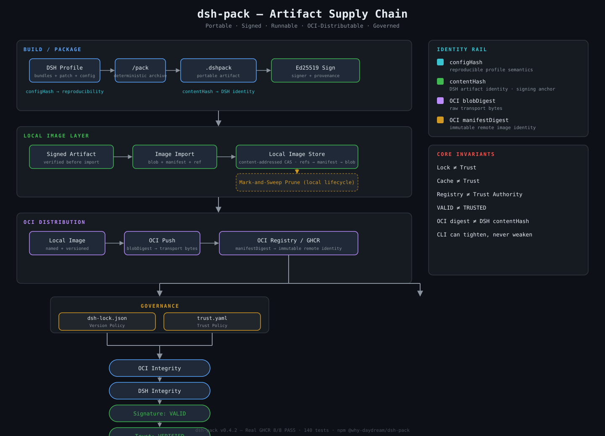

# dsh-pack

> **Reproducible, portable, signed, runnable and OCI-distributable Agent Artifacts for DeepSeek Harness.**
>
> `npm install @why-daydream/dsh-pack`

**English** · [简体中文](./README.zh-CN.md)

[](https://www.npmjs.com/package/@why-daydream/dsh-pack)
[](https://github.com/WHY-Daydream/dsh-pack/releases/tag/v0.4.2)
[](https://github.com/WHY-Daydream/dsh-pack/actions/runs/33292227705)
[](LICENSE)

---

## Install

### DSH Plugin (recommended)

```bash
dsh plugin --profile demo add @why-daydream/dsh-pack
```

Pin a version:

```bash
dsh plugin --profile demo add @why-daydream/dsh-pack@0.4.2
```

### npm

```bash
npm install @why-daydream/dsh-pack
```

---

## 30s Quick Start

```bash
# Install the plugin
dsh plugin --profile demo add @why-daydream/dsh-pack

# Pack a profile into a reproducible .dshpack
/pack web --portable

# Inspect the artifact
/pack inspect web-<date>.dshpack

# Verify integrity + signature
/pack verify web-<date>.dshpack --require-signature
```

### End-to-End Pipeline

```text
Profile
  ↓ /pack
.dshpack
  ↓ /sign
Trusted Artifact
  ↓ image import
Agent Image
  ↓ /push
GHCR / OCI Registry
  ↓ image lock + trust.yaml
Governed Runtime
```

## Demo

Reproducible terminal recording of the full chain (pack → sign → import → lock → verify → run):

```text
contentHash: sha256:...

Signature: VALID
Trust: VERIFIED

demo/agent:prod
→ ghcr.io/.../agent@sha256:<manifestDigest>

Agent image started
```

- Recording script: `demo/recording/demo.sh` (`DEMO_MODE=local` by default; `DEMO_MODE=ghcr` shows real push/lock)
- Deterministic recording: `demo/recording/demo.tape` (VHS)

---

## Version Evolution

```text
v0.1   Snapshot      — Reproducible profile configuration snapshot
  ↓
v0.2   Portable      — Ships local dependencies together
  ↓
v0.3   Trusted       — Ed25519 signing + provenance verification
  ↓
v0.4   Runnable      — Agent Image model: named, versioned, runnable
  ↓
v0.4.1 Distributed   — OCI push/pull (GHCR, Docker Hub, any registry)
  ↓
v0.4.2 Governed      — image lock + trust.yaml + local prune + Real GHCR 8/8 PASS
```

---

## Architecture — Artifact Supply Chain

<p align="center">
  
</p>

> Editable Mermaid source: [`docs/architecture.md`](docs/architecture.md) (README renders the SVG by default for consistent cross-platform display).

### Identity Model — Four Layers

```text
configHash
    ↓
Profile reproducibility

contentHash
    ↓
DSH artifact identity / signing

OCI blobDigest
    ↓
Transport bytes integrity

OCI manifestDigest
    ↓
Remote immutable image identity
```

### Core Invariants

```text
Lock ≠ Trust               — Version governance ≠ execution governance
Cache ≠ Trust              — A cached image is not automatically trusted
Registry ≠ Trust Authority — The registry is a distribution channel, not a trust source
VALID ≠ TRUSTED            — A valid signature from an unknown key is still untrusted
OCI Digest ≠ DSH contentHash — Transport identity ≠ artifact identity
CLI can tighten policy, never weaken it
```

---

## Commands

| Command | Description |
|------|------|
| `/pack [name]` | Pack the current profile (`--strict` / `--out` / `--allow-secrets` / `--allow-nonportable`) |
| `/pack <name> --portable` | Pack with local `file:`/`link:` dependencies vendored |
| `/pack inspect <file>` | Show an artifact summary (`--json`) |
| `/pack verify <file>` | Verify integrity: Manifest / Config / Packages / Checksums / DSH Version / Signature (`--json`, `--require-signature`) |
| `/pack install <file>` | Restore to `$DSH_HOME/profiles/<name>` (staging + atomic swap + frozen-lockfile) |
| `/pack diff <a> <b>` | Compare configuration drift between two packs: Manifest / Bundles / Config / Dependencies + configHash |
| `/pack keygen [--out <dir>]` | Generate an ed25519 keypair (v0.3: private key chmod 600 + public key + keyId) |
| `/pack sign <file> --key <pem> [--signer <name>]` | Embed a signature + provenance, produce `<name>.signed.dshpack` (v0.3) |
| `/pack image import` | Import a `.dshpack` as a local Agent Image (tag / digest) |
| `/pack image ls` | List local Agent Image repositories |
| `/pack image tag` | Add / move a tag on a local image |
| `/pack image rm` | Remove a local image / tag |
| `/pack image lock` | Freeze a mutable remote tag to an immutable manifest digest |
| `/pack image prune` | Mark-and-sweep GC: remove unreachable manifest/blob (dry-run default, `--apply` deletes) |
| `/pack push <localRef> <remoteRef>` | Push an Agent Image to an OCI Registry (GHCR / Docker Hub) |
| `/pack pull <remoteRef>` | Pull an Agent Image and verify integrity |
| `/pack run <ref> [--require-trusted]` | Run an Agent Image (integrity + trust policy + temporary runtime or persistent profile) |

---

## Distribution

### npm

```bash
npm install @why-daydream/dsh-pack
```

📦 [@why-daydream/dsh-pack](https://www.npmjs.com/package/@why-daydream/dsh-pack) — `v0.4.2`

### GitHub Release

🔖 [v0.4.2 — Distribution Governance](https://github.com/WHY-Daydream/dsh-pack/releases/tag/v0.4.2)

### OCI / GHCR

Protocol-tested against GHCR: **8/8 items PASS** ([run #33292227705](https://github.com/WHY-Daydream/dsh-pack/actions/runs/33292227705)).

```text
① Bearer challenge      ② Token acquisition (pull,push)
③ HEAD blob 404 → 200   ④ POST uploads/ → PUT ?digest → 201
⑤ OCI manifest PUT      ⑥ Tag pull Content-Type + Docker-Content-Digest
⑦ Digest pull identity   ⑧ DSH contentHash + Signature + Trust + run configHash
```

### DSH Community

📢 [DSH Discussion](https://github.com/WHY-Daydream/dsh-pack/discussions) — community discussion and usage

---

## Verification Status

| Dimension | Status |
|------|------|
| Local test suite | **140 tests / 21 files** — all passing (mock OCI registry, signing E2E, trust policy, image lock, GC prune) |
| typecheck (`tsc -b`) | ✅ Passing |
| lint (`oxlint`) | ✅ 0 errors |
| Real GHCR E2E | ✅ **8/8 PASS** (run 33292227705, 2026-08-30) |
| npm tgz clean-room | ✅ install + import passing |
| npm registry | ✅ published + install + import passing |

---

## Known Limitations

1. **pnpm v11 virtual-store layout**: after `--portable` restore, transitive `file:` dependencies may live under `.pnpm` virtual storage instead of top-level `node_modules`. Functionality and the frozen-install loop still hold; byte-for-byte `node_modules` layout parity is limited by pnpm behavior, not a package defect.
2. **Three real engineering pitfalls fixed in `--portable`** (all covered by regression tests; see `DESIGN.md` Appendix D and `TRACEABILITY.md`):
   - async staging race (early `return` before `await` deleted the staging dir → intermittent ENOENT);
   - the rewritten `package.json` being overwritten by the copy step;
   - pnpm lockfile's project-relative `file:` semantics (addressed relative to the project root, not the declaring dir).
3. **Non-reproducible items**: floating git branches (no `#commit` anchor, fail under `--strict`); home-layer and `--patch` overlays (machine/invocation-local, not packed but warned); `--allow-nonportable` output is `installable:false` and install refuses it by default.
4. **Security boundary**: `.dshpack` forbids real secrets (composite-tree scan + redaction to `${VAR}` + `.env.example`; install never restores secrets); archive extraction guards against path traversal and symlink/hardlink/device entries.

---

## Docs

- `DESIGN.md` — frozen protocol (format, hash algorithms, security model, command behavior)
- `DESIGN-v0.4.2.md` — four-layer Governance design (image lock / trust.yaml / local prune / GHCR 8/8)
- `TRACEABILITY.md` — trace each frozen decision → source file → test case
- `CHANGELOG.md` — version history
- `LICENSE` — MIT

---

## License

MIT © [WHY-Daydream](https://github.com/WHY-Daydream/dsh-pack)
