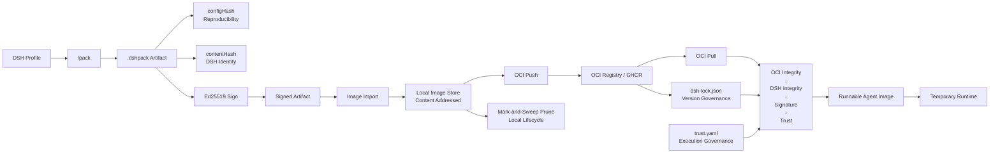

# Architecture — Artifact Supply Chain

> 本文档是 **README 架构图的 Mermaid 可编辑源图**（`README.md` 默认展示
> `docs/assets/dsh-pack-architecture.svg`，本文件为维护用源）。
> 修改流程：改 Mermaid → 重新生成/同步 SVG → 更新 README 引用。

## Mermaid（可编辑源）



## Identity Model — Four Layers

```text
configHash
    ↓
Profile reproducibility

contentHash
    ↓
DSH artifact identity / signing

OCI blobDigest
    ↓
Transport bytes integrity

OCI manifestDigest
    ↓
Remote immutable image identity
```

## Core Invariants

```text
Lock ≠ Trust               — Version governance ≠ execution governance
Cache ≠ Trust              — A cached image is not automatically trusted
Registry ≠ Trust Authority — The registry is a distribution channel, not a trust source
VALID ≠ TRUSTED            — A valid signature from an unknown key is still untrusted
OCI Digest ≠ DSH contentHash — Transport identity ≠ artifact identity
CLI can tighten policy, never weaken it
```
